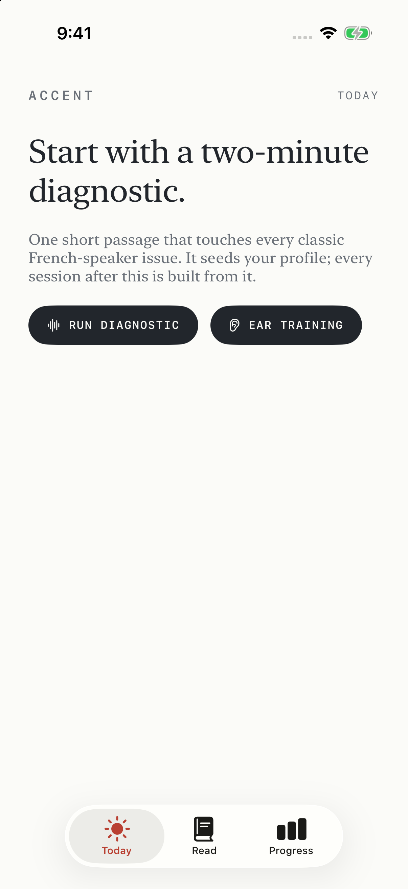
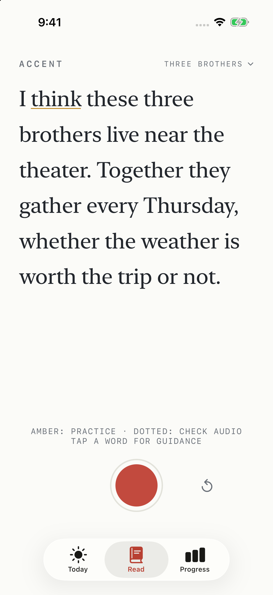
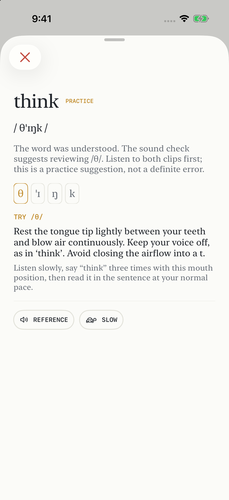

<p align="center">
  
</p>

# Accent

**A private English pronunciation coach in your pocket.**

Read a short passage. Listen to yourself. Practice one sound at a time.

Accent is a native iPhone app for French speakers practicing American English.
It follows your reading, lets you compare a recorded word with a spoken reference,
and offers concrete mouth-position cues and focused drills. Speech recognition,
sound analysis, and optional Apple Intelligence passage generation run on device.
No account, API key, subscription, analytics SDK, or app backend.

**Status: experimental.** This is a working development project, not a validated
pronunciation assessment or an App Store release. Native speakers can still be
flagged, and some sound substitutions are missed. Suggestions are invitations to
listen and practice; they are not proof that a pronunciation is wrong.

<p align="center">
  
  
  
</p>

Screenshots show the real simulator UI with illustrative demo results, not a
real recording or evidence of model accuracy. The DEBUG-only `-screenshotDemo
today|read|word` launch option uses an in-memory store without microphone access.

## What you can do

- Start with a diagnostic covering common French-to-English sound differences.
- Read curated passages or paste your own text, with live word tracking.
- Review recognition separately from pronunciation suggestions.
- Replay your word and a US English reference at normal or slower speed.
- Practice mouth-position cues, minimal pairs, and focused passages.
- Use ear training to work on hearing sound differences.
- Keep takes and assessed sound history locally with SwiftData.

## Build and run

You need an **Apple Silicon Mac**, **Xcode 27 or later** (currently a beta toolchain),
and an **iPhone or simulator running iOS 26 or later**. Xcode 27 is required to
compile the new audio-session API; the app uses a background-queue fallback on
iOS 26. Real microphone use is best tested on an iPhone. Local English speech
assets must be available; Accent refuses server-based speech recognition.

```sh
git clone https://github.com/danielwanja/accent.git
cd accent
open Accent.xcodeproj
```

Choose the **Accent** scheme and a simulator, then Run. For your own iPhone, select
your signing team and unique bundle identifiers for the app and UI-test targets.
No personal signing team is committed.

Or use the command line:

```sh
./run.sh
# Choose another installed simulator:
SIM_UDID=YOUR_SIMULATOR_UDID ./run.sh
```

The scripts honor `DEVELOPER_DIR`; otherwise they prefer
`/Applications/Xcode-beta.app` when installed. Their default simulator is
**iPhone 17 Pro / iOS 26.2**. List installed devices with
`xcrun simctl list devices available`.

### Optional phoneme model

The large model weights are excluded from Git. Without them you can build the app,
read with speech recognition, play references, and use curated drills, but
phoneme-based sound assessment is unavailable.

To enable it, use Python 3.13 on macOS:

```sh
python3.13 -m venv tools/venv
tools/venv/bin/python -m pip install -r tools/requirements-model.txt
./tools/setup-model.sh
```

Setup downloads the public MultiBridge checkpoint from Hugging Face, converts it
to FP16 Core ML, checks conversion agreement, and copies the model and matching
labels into the app. It needs internet access and several GB of free memory/disk.
The resulting model is about 189 MB. These are build-time downloads; app recordings
are not uploaded. Model rights are separate from the app's MIT license; see
[third-party notices](THIRD_PARTY_NOTICES.md).

### Apple Intelligence

On supported devices with Apple Intelligence enabled and its model available,
`Coach.swift` uses `LanguageModelSession` and guided generation to write a short
practice passage for a selected sound. It checks that the generated passage
contains several target-sound words. If generation is unavailable or fails,
the app uses a curated drill. Apple Intelligence does **not** grade recordings.

## Tests

```sh
./test.sh --quick  # 298 regression checks; no model or simulator needed
./test.sh --audio  # Synthetic-audio checks; requires the converted model
./test.sh --ui     # Builds the app and runs 5 simulator UI tests
./test.sh          # All three suites
```

Pass `--destination 'platform=iOS Simulator,name=iPhone 17 Pro,OS=26.2'` or set
`SIM_UDID` to choose a simulator. UI logs and result bundles are saved under
`build/test-results/`. See [testing notes](tools/TESTING.md) for the audio activation
smoke hook, measured results, and the limits of synthetic evaluation.

## How it works

| Layer | Role |
| --- | --- |
| SpeechAnalyzer + SpeechTranscriber | Local speech-to-text with word timing and revisable partial results |
| SFSpeechRecognizer | Fallback only when on-device recognition is supported |
| TranscriptBuffer + passage alignment | Replace revised audio ranges and follow the passage without marking its unread suffix |
| Core ML phoneme recognizer + CMUdict | Compare sound evidence with dictionary pronunciations after the take |
| Phonics | French-speaker sound taxonomy, cues, minimal pairs, and curated drills |
| Foundation Models | Optional local generation of focused practice passages |
| AVFoundation + SwiftData | Recording, reference playback, word clips, and local history |

Recognition confidence alone does not establish a pronunciation error. The scorer
leaves unreliable evidence unassessed, and a dotted underline asks you to check
recognition. An amber word suggests a sound to practice. Natural timing, dialect
variation, and imperfect alignment still affect the results. Human listening
and held-out recordings are needed before making accuracy claims.

## Privacy

Recordings and practice history stay in the app's local container. There is no
app-operated server or analytics. System model/voice downloads may require a
connection, and ordinary device backups may include app data. Debug builds log
transcript snippets for development; do not post unredacted logs or personal
recordings in issues. See [PRIVACY.md](PRIVACY.md).

## Contributing and licensing

See [CONTRIBUTING.md](CONTRIBUTING.md) for setup and useful areas to improve,
and [SECURITY.md](SECURITY.md) for private vulnerability reporting.

The original app code and documentation are available under the [MIT license](LICENSE).
CMUdict retains its own redistribution notice. The MultiBridge model and its
derived labels are credited under **CC BY 4.0**; model weights are not included
in this repository. See [THIRD_PARTY_NOTICES.md](THIRD_PARTY_NOTICES.md).

Built by [Daniel Wanja](https://n-so.com).
